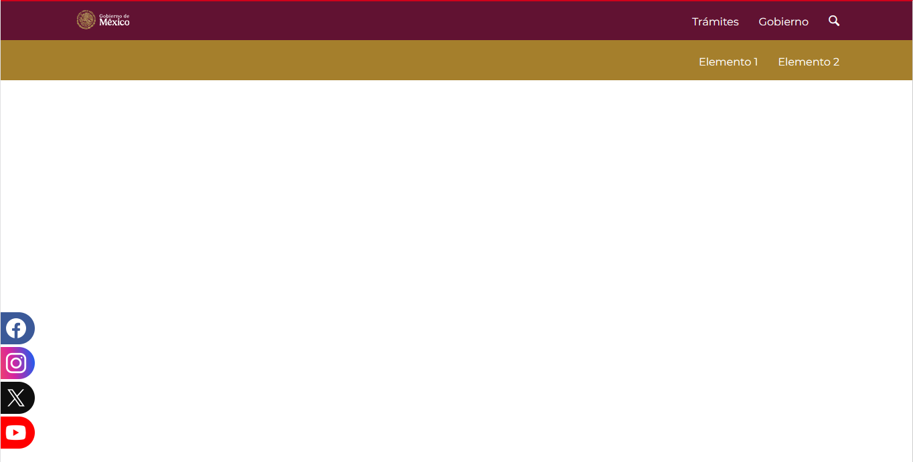
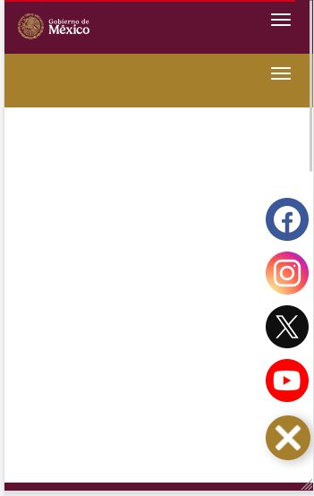

# Widget para redes sociales

## Desarrollado para el sitio principal de la SEP en gob.mx

Este widget muestra pestañas de las redes sociales de la institución en su versión de escritorio y como un botón cercano a la esquina inferior derecha en móviles.

El cambió de presentación lo hace mediante un _media query_ en css.





---

## Uso

Para utilizarlo en tu sitio simplemente copia el código y sustituye el usuario por el de tus redes.


```
    <a href="//facebook.com/sepmx">
        <div class="social-btn color-facebook">
                <div class="icon-facebook"></div>
            .....


```

Para usar en el cms de [gob.mx](https://www.gob.mx) debes utilizar un piso **"HTML libre"**


